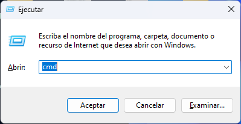

## Abrir CMD  

1. Desde el teclado: Pulsa la tecla **Windows + R.** Escribe **«cmd»** en el cuadro Ejecutar. Pulsa Enter para abrir CMD.

Aquí tienes una lista de comandos de CMD más utilizados y su sintaxis:

1. **dir**: Muestra el contenido de un directorio.
   Sintaxis: `dir [ruta]`

2. **cd**: Cambia el directorio actual.
   Sintaxis: `cd [ruta]`

3. **mkdir**: Crea un nuevo directorio.
   Sintaxis: `mkdir nombre_directorio`

4. **rmdir**: Elimina un directorio vacío.
   Sintaxis: `rmdir nombre_directorio`

5. **del**: Elimina un archivo.
   Sintaxis: `del nombre_archivo`

6. **copy**: Copia archivos o carpetas.
   Sintaxis: `copy origen destino`

7. **move**: Mueve archivos o carpetas.
   Sintaxis: `move origen destino`

8. **ren**: Cambia el nombre de un archivo o carpeta.
   Sintaxis: `ren nombre_actual nombre_nuevo`

9. **type**: Muestra el contenido de un archivo de texto.
   Sintaxis: `type nombre_archivo`

10. **ping**: Envía un paquete de datos a una dirección IP para comprobar la conectividad de red.
    Sintaxis: `ping dirección_IP`

11. **ipconfig**: Muestra la configuración de red de tu computadora.
    Sintaxis: `ipconfig`

12. **tasklist**: Muestra una lista de los procesos en ejecución.
    Sintaxis: `tasklist`

13. **taskkill**: Termina un proceso en ejecución.
    Sintaxis: `taskkill /PID ID_proceso`

14. **systeminfo**: Muestra información detallada sobre la configuración de hardware y software de tu computadora.
    Sintaxis: `systeminfo`

Recuerda que la sintaxis puede variar ligeramente dependiendo de la versión del sistema operativo. Además, algunos comandos pueden tener opciones adicionales que pueden ser especificadas después del nombre del comando. Puedes utilizar el comando `help` seguido del nombre del comando para obtener más información y opciones específicas de cada comando. Por ejemplo, `help dir` mostrará información detallada sobre el comando `dir`.