1# Su empresa tiene departamentos de servicio. Cada departamento tiene un número de máquinas virtuales (VM).
La compañía tiene una suscripción de Azure que contiene un grupo de recursos denominado RG1.
Todas las máquinas virtuales se encuentran en RG1.
Desea asociar cada máquina virtual con su departamento respectivo.

¿Qué debe hacer?

a. Cree grupos de administración de Azure para cada departamento.

B. Cree un grupo de recursos para cada departamento.

>C. Asigne etiquetas a las máquinas virtuales. Más votados

D. Modifique la configuración de las máquinas virtuales.

2# Su empresa tiene una suscripción a Azure Active Directory (Azure AD).
Desea implementar una directiva de acceso condicional de Azure AD.
La directiva debe configurarse para requerir que los miembros del grupo Administradores globales usen Multi-Factor Authentication y un dispositivo unido a Azure AD cuando se conecten a Azure AD desde ubicaciones que no sean de confianza.
Solución: acceda a Azure Portal para modificar el control de concesión de la directiva de acceso condicional de Azure AD.

¿La solución cumple con el objetivo?

>A. Sí Más votados

B. No

3# Está planeando implementar una máquina virtual de Ubuntu Server en la suscripción de Azure de su empresa.
Debe implementar una implementación personalizada que incluya la adición de una entidad de certificación raíz (CA) de confianza.

¿Cuál de las siguientes opciones debe usar para crear la máquina virtual?

a. El cmdlet New-AzureRmVm.

B. El cmdlet New-AzVM.

>C. El cmdlet Create-AzVM.

D. El comando az vm create

4# La solución Azure de su empresa usa Multi-Factor Authentication para cuando los usuarios no están en la oficina. La opción Por autenticación se ha configurado como modelo de uso.
Después de la adquisición de una empresa más pequeña y la adición del nuevo personal a Azure Active Directory (Azure AD) obtiene una empresa diferente y la adición de los nuevos empleados a Azure Active Directory (Azure AD), se le informa que estos empleados también deben hacer uso de Multi-Factor Authentication.
Para lograr esto, la configuración Por usuario habilitado debe establecerse para el modelo de uso.
Solución: cree un nuevo proveedor de Multi-Factor Authentication con una copia de seguridad de los datos existentes del proveedor de Multi-Factor Authentication.

¿La solución cumple con el objetivo?

>a. Sí Más votados

B. No Más votados

5# Su empresa tiene un inquilino de Azure Active Directory (Azure AD) denominado weyland.com que está configurado para la coexistencia híbrida con el dominio local de Active
Directory.
Tiene un servidor denominado DirSync1 que está configurado como un servidor DirSync.
Crear una nueva cuenta de usuario en Active Directory local. Ahora debe replicar la información de usuario en Azure AD inmediatamente.
Solución: ejecute el cmdlet Start-ADSyncSyncCycle -PolicyType Initial PowerShell.

¿La solución cumple con el objetivo?

>A. Sí

B. No

6# Su empresa tiene una suscripción de Azure que incluye una cuenta de almacenamiento, un grupo de recursos, un contenedor de blobs y un recurso compartido de archivos.
Un colega llamado Jon Ross usa una plantilla solitaria de Azure Resource Manager (ARM) para implementar una máquina virtual y una cuenta de Azure Storage adicional.
Desea revisar la plantilla de ARM que usó Jon Ross.
Solución: obtenga acceso a la hoja Grupo de recursos.

¿La solución cumple con el objetivo?

>A. Sí Más votados

B. No

7# Su empresa tiene tres máquinas virtuales (VM) que se incluyen en un conjunto de disponibilidad.
Intenta cambiar el tamaño de una de las máquinas virtuales, que devuelve un mensaje de error de asignación.
Es imperativo que se cambie el tamaño de la máquina virtual.

¿Cuál de las siguientes acciones debería tomar?

A. Solo debe detener una de las máquinas virtuales.

B. Debe detener dos de las máquinas virtuales.

>C. Debe detener las tres máquinas virtuales. Más votados

D. Debe quitar la máquina virtual necesaria del conjunto de disponibilidad.

8# Tiene una máquina virtual (VM) de Azure que tiene un único disco de datos. Se le ha encomendado la tarea de adjuntar este disco de datos a otra máquina virtual de Azure.
Debe asegurarse de que su estrategia permita que las máquinas virtuales estén sin conexión durante el menor tiempo posible.

¿Cuál de las siguientes es la acción que debe tomar PRIMERO?

>A. Detenga la máquina virtual que incluye el disco de datos.

B. Detenga la máquina virtual a la que se debe conectar el disco de datos.

C. Separe el disco de datos. Más votados

D. Elimine la máquina virtual que incluye el disco de datos.

9# Su empresa tiene una suscripción de Azure.
Debe implementar varias máquinas virtuales (VM) de Azure mediante plantillas de Azure Resource Manager (ARM). Se le ha informado de que las máquinas virtuales se incluirán en un único conjunto de disponibilidad.
Debe asegurarse de que la plantilla de ARM que configure permita que permanezcan accesibles tantas máquinas virtuales como sea posible en caso de error o mantenimiento del tejido.

¿Cuál de los siguientes es el valor que debe configurar para la propiedad platformFaultDomainCount?

A. 10

B. 30

C. Valor mínimo

>D. Valor máximo Más

10# Su empresa tiene una suscripción de Azure.
Debe implementar varias máquinas virtuales (VM) de Azure mediante plantillas de Azure Resource Manager (ARM). Se le ha informado de que las máquinas virtuales se incluirán en un único conjunto de disponibilidad.
Debe asegurarse de que la plantilla de ARM que configure permita que permanezcan accesibles tantas máquinas virtuales como sea posible en caso de error o mantenimiento del tejido.

¿Cuál de los siguientes es el valor que debe configurar para la propiedad platformUpdateDomainCount?

Un. 10

> B. 20 Más votados

C. 30

D. 40

ARRASTRAR Y COLOCAR:
11# ha descargado una plantilla de Azure Resource Manager (ARM) para implementar numerosas máquinas virtuales (VM). La plantilla de ARM se basa en una máquina virtual actual, pero debe adaptarse para hacer referencia a una contraseña administrativa.
Debe asegurarse de que la contraseña no se pueda almacenar en texto sin formato.
Se está preparando para crear los componentes necesarios para lograr su objetivo.

¿Cuál de los siguientes debe crear para lograr su objetivo? Responda arrastrando la opción correcta de la lista al área de respuesta.
Seleccione y coloque:

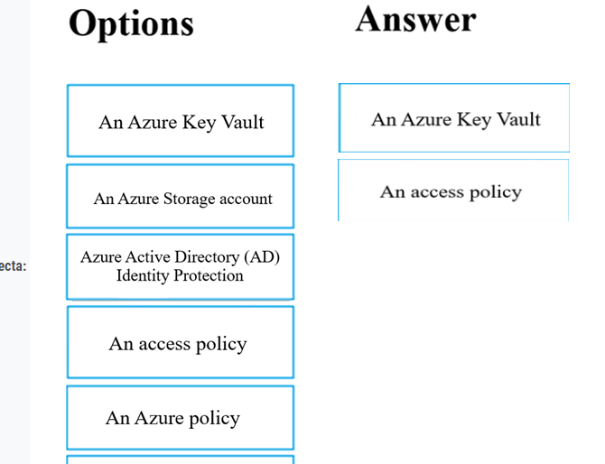

12# Su empresa tiene un inquilino de Azure Active Directory (Azure AD) configurado para la coexistencia híbrida con el dominio local de Active Directory.
El entorno virtual local consta de máquinas virtuales (VM) que se ejecutan en servidores host Hyper-V de Windows Server 2012 R2.
Ha creado algunos scripts de PowerShell para automatizar la configuración de máquinas virtuales recién creadas. Tiene previsto crear varias máquinas virtuales nuevas.Necesita una solución que garantice que los scripts se ejecutan en las nuevas máquinas virtuales.

¿Cuál de las siguientes es la mejor solución?

>A. Configure un archivo por lotes SetupComplete.cmd en el directorio %windir%\setup\scripts.

B. Configure un objeto de directiva de grupo (GPO) para ejecutar los scripts como scripts de inicio de sesión.

C. Configure un objeto de directiva de grupo (GPO) para ejecutar los scripts como scripts de inicio.

D. Coloque los scripts en un nuevo disco duro virtual (VHD).

13# Su empresa tiene un inquilino de Azure Active Directory (Azure AD) configurado para la coexistencia híbrida con el dominio local de Active Directory.
Planea implementar varias máquinas virtuales (VM) nuevas en Azure. Las máquinas virtuales tendrán el mismo sistema operativo y requisitos de software personalizados.
Configure una máquina virtual de referencia en el entorno virtual local. A continuación, generalice la máquina virtual para crear una imagen.
Debe cargar la imagen en Azure para asegurarse de que está disponible para su selección al crear las nuevas máquinas virtuales de Azure.

¿Qué cmdlets de PowerShell debe usar?

A. Add-AzVM

>B. Add-AzVhd Más votados

C. Add-AzImage

D. Add-AzImageDataDisk

ARRASTRAR SUÉLTELO:
14# su empresa tiene una suscripción de Azure que incluye varias máquinas virtuales (VM) de Azure, que forman parte de la misma red virtual.
Su empresa también tiene un servidor Hyper-V local que hospeda una máquina virtual, denominada VM1, que debe replicarse en Azure.

¿Cuál de los siguientes objetos que se deben crear para lograr este objetivo? Responda arrastrando la opción correcta de la lista al área de respuesta.
Seleccione y coloque:

15# La suscripción de Azure de su empresa incluye dos redes de Azure denominadas VirtualNetworkA y VirtualNetworkB.
VirtualNetworkA incluye una puerta de enlace VPN que está configurada para hacer uso del enrutamiento estático. Además, existe una conexión VPN de sitio a sitio entre la red local de su empresa y VirtualNetworkA.
Ha configurado una conexión VPN de punto a sitio a VirtualNetworkA desde una estación de trabajo que ejecuta Windows 10. Después de configurar el emparejamiento de red virtual entre
VirtualNetworkA y VirtualNetworkB, confirma que puede tener acceso a VirtualNetworkB desde la red local de la empresa. Sin embargo, encuentra que no puede establecer una conexión a VirtualNetworkB desde la estación de trabajo de Windows 10.
Debe asegurarse de que se pueda establecer una conexión a VirtualNetworkB desde la estación de trabajo con Windows 10.
Solución: descargue y vuelva a instalar el paquete de configuración del cliente VPN en la estación de trabajo con Windows 10.

¿La solución cumple con el objetivo?

>A. Sí Más votados

B. No

16# Su empresa tiene máquinas virtuales (VM) hospedadas en Microsoft Azure. Las máquinas virtuales se encuentran en una única red virtual de Azure denominada VNet1.
La empresa tiene usuarios que trabajan de forma remota. Los trabajadores remotos requieren acceso a las máquinas virtuales en VNet1.

Debe proporcionar acceso a los trabajadores remotos.
¿Qué debe hacer?

A. Configure una VPN de sitio a sitio (S2S).

B. Configure una VPN de red virtual a red virtual.

>C. Configure una VPN de punto a sitio (P2S). Más votados

D. Configurar DirectAccess en una máquina virtual de servidor de Windows Server 2012.

E. Configurar una VPN multisitio

17# Nota: La pregunta se incluye en una serie de preguntas que representan la configuración idéntica. Sin embargo, cada pregunta tiene un resultado distintivo. Establezca si la solución satisface los requisitos.
Su empresa tiene un grupo de disponibilidad Always On de Microsoft SQL Server configurado en sus máquinas virtuales (VM) de Azure.
Debe configurar un equilibrador de carga interno de Azure como agente de escucha para el grupo de disponibilidad.
Solución: habilite la IP flotante.

¿La solución cumple con el objetivo?

>A. Sí Más votados

B. No

18# Su empresa tiene dos servidores locales denominados SRV01 y SRV02. Los desarrolladores han creado una aplicación que se ejecuta en SRV01. La aplicación llama a un servicio en SRV02 por dirección IP.
Tiene previsto migrar la aplicación en máquinas virtuales (VM) de Azure. Ha configurado dos máquinas virtuales en una sola subred de una red virtual de Azure.
Debe configurar las dos máquinas virtuales con direcciones IP internas estáticas.

¿Qué debe hacer?

A. Ejecute el cmdlet New-AzureRMVMConfig PowerShell.

B. Ejecute el cmdlet de PowerShell Set-AzureSubnet.

C. Modifique las propiedades de la máquina virtual en el Portal de administración de Azure.

D. Modifique las propiedades IP en el Centro de redes y recursos compartidos de Windows.

>E. Ejecute el cmdlet de PowerShell Set-AzureStaticVNetIP.

19# Su empresa tiene una suscripción a Azure Active Directory (Azure AD).
Debe implementar cinco máquinas virtuales (VM) en la subred de red virtual de su empresa.
Cada máquina virtual tendrá una dirección IP pública y privada. Las reglas de seguridad de entrada y salida para todas estas máquinas virtuales deben ser idénticas.

¿Cuál de las siguientes es la menor cantidad de interfaces de red necesarias para esta configuración?

>A. 5 Más votados

B. 10

C. 20

D. 40

20# Su empresa tiene una suscripción a Azure Active Directory (Azure AD).
Debe implementar cinco máquinas virtuales (VM) en la subred de red virtual de su empresa.
Cada máquina virtual tendrá una dirección IP pública y privada. Las reglas de seguridad de entrada y salida para todas estas máquinas virtuales deben ser idénticas.

¿Cuál de las siguientes es la menor cantidad de grupos de seguridad necesarios para esta configuración?

>A. 4

B. 3

C. 2

D. 1

21# La suscripción de Azure de su empresa incluye máquinas virtuales (VM) de Azure que ejecutan Windows Server 2016.
Se realiza una copia de seguridad de una de las máquinas virtuales todos los días mediante Restauración instantánea de Copia de seguridad de Azure.
Cuando la máquina virtual se infecta con ransomware de cifrado de datos, decide recuperar los archivos de la máquina virtual.

¿Cuál de las siguientes opciones es VERDADERA en este escenario?

Un. Solo puede recuperar los archivos en la máquina virtual infectada.

>B. Puede recuperar los archivos en cualquier máquina virtual dentro de la suscripción de la empresa. Más votados

C. Solo puede recuperar los archivos en una nueva máquina virtual.

D. No podrá recuperar los archivos.

22# La suscripción de Azure de su empresa incluye máquinas virtuales (VM) de Azure que ejecutan Windows Server 2016.
Se realiza una copia de seguridad de una de las máquinas virtuales todos los días mediante Restauración instantánea de Copia de seguridad de Azure.
Cuando la máquina virtual se infecta con ransomware de cifrado de datos, debe restaurar la máquina virtual.

¿Cuál de las siguientes acciones debería tomar?

A. Debe restaurar la máquina virtual después de eliminar la máquina virtual infectada.

>B. Debe restaurar la máquina virtual en cualquier máquina virtual dentro de la suscripción de la empresa.

C. Debe restaurar la máquina virtual en una nueva máquina virtual de Azure. Más votados

D. Debe restaurar la máquina virtual en un dispositivo Windows local.

23# Administrar una solución en Azure que actualmente tiene problemas de rendimiento.
Debe encontrar la causa de los problemas de rendimiento relacionados con las métricas en la infraestructura de Azure.

¿Cuál de las siguientes es la herramienta que debe usar?

A. Análisis de tráfico de Azure

>B. Azure Monitor Más votados

C. Registro de actividad de Azure

D. Azure Advisor

24# Su empresa tiene una suscripción de Azure que incluye un almacén de Recovery Services.
Desea usar Copia de seguridad de Azure para programar una copia de seguridad de las máquinas virtuales (VM) de su empresa en el almacén de Recovery Services.
¿De cuál de las siguientes máquinas virtuales puede hacer una copia de seguridad? Elija todas las que correspondan.

> Respuesta correcta: ABCDE 🗳️

25# Después de responder a una pregunta de esta sección, NO podrá volver a ella. Como resultado, estas preguntas no aparecerán en la pantalla de revisión.
Tiene un inquilino de Azure Active Directory (Azure AD) denominado contoso.com.
Tiene un archivo CSV que contiene los nombres y direcciones de correo electrónico de 500 usuarios externos.
Debe crear una cuenta de usuario invitado en contoso.com para cada uno de los 500 usuarios externos.
Solución: cree un script de PowerShell que ejecute el cmdlet New-AzureADMSInvitation para cada usuario externo.

¿Esto cumple con el objetivo?

>A. Sí Más votados

B. No

26# tiene una suscripción de Azure denominada Subscription1 que contiene un grupo de recursos denominado RG1.
En RG1, se crea un equilibrador de carga interno denominado LB1 y un equilibrador de carga público denominado LB2.
Debe asegurarse de que un administrador denominado Admin1 pueda administrar LB1 y LB2. La solución debe seguir el principio del privilegio mínimo.
¿Qué rol debe asignar a Admin1 para cada tarea? Para responder, seleccione las opciones apropiadas en el área de respuesta.
NOTA: Cada selección correcta vale un punto.
Zona caliente:

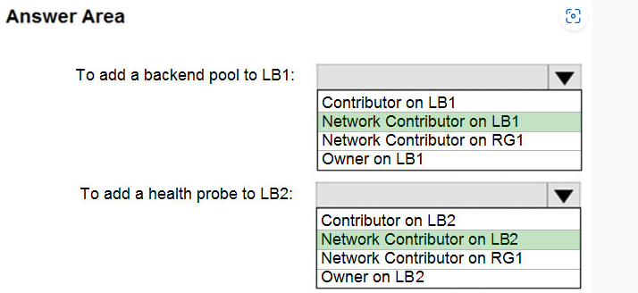

27# Tiene una suscripción de Azure que contiene un inquilino de Azure Active Directory (Azure AD) denominado contoso.com y un clúster de Azure Kubernetes Service (AKS) denominado AKS1.
Un administrador informa de que no puede conceder acceso a AKS1 a los usuarios de contoso.com.
Debe asegurarse de que se pueda conceder acceso a AKS1 a los usuarios contoso.com.

¿Qué debes hacer primero?

A. Desde contoso.com, modifique la configuración de relaciones de la organización.

>B. Desde contoso.com, cree un extremo de autorización de OAuth 2.0. Más votados

C. Vuelva a crear AKS1.

D. En AKS1, cree un espacio de nombres.

HOTSPOT
28# : tiene un inquilino de Azure Active Directory (Azure AD) denominado contoso.com que contiene los usuarios que se muestran en la tabla siguiente:

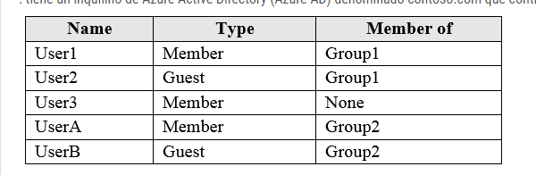

29# User3 es el propietario de Group1.
 Group2 es miembro de Group1.
Configure una revisión de Access denominada Review1 como se muestra en la siguiente exposición:

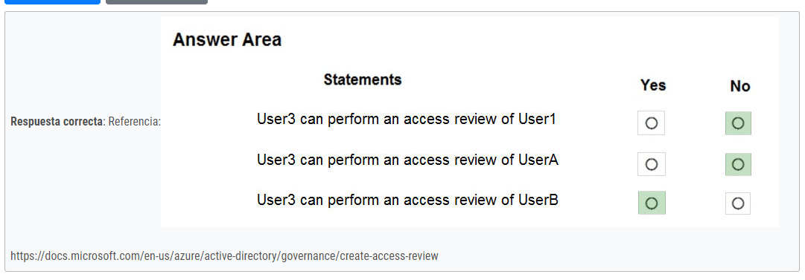

HOTSPOT -
30# Tiene los grupos de administración de Azure que se muestran en la tabla siguiente:Agregar suscripciones de Azure a los grupos de administración como se muestra en la tabla siguiente:Crear las directivas de Azure que se muestran en la tabla siguiente:

Para cada una de las siguientes instrucciones, seleccione Sí si la instrucción es true. De lo contrario, seleccione No.NOTA: Cada selección correcta vale un punto.

Zona caliente:

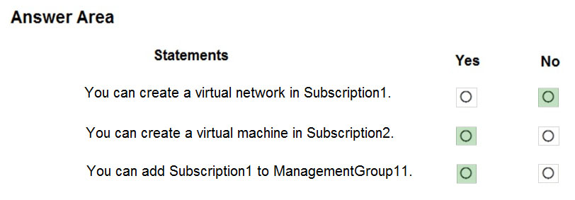

31# Tiene una directiva de Azure, como se muestra en el siguiente documento:

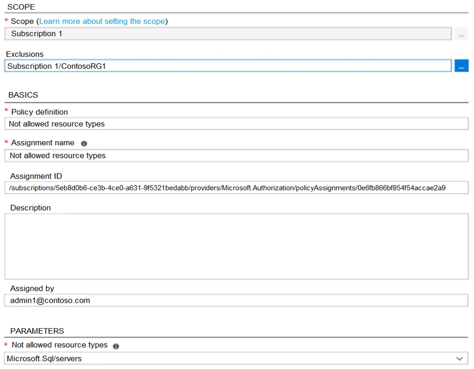

¿Cuál es el efecto de la directiva?

A. No puede crear servidores SQL de Azure en ningún lugar de la suscripción 1.

>B. Solo puede crear servidores SQL de Azure en ContosoRG1. Más votados

C. No puede crear servidores SQL Server de Azure solo en ContosoRG1.

D. Puede crear servidores SQL de Azure en cualquier grupo de recursos dentro de la suscripción 1.

 32# Tiene una suscripción de Azure denominada AZPT1 que contiene los recursos que se muestran en la tabla siguiente:

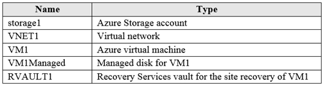

Crear una nueva suscripción de Azure denominada AZPT2.
Debe identificar qué recursos se pueden mover a AZPT2.

¿Qué recursos debe identificar?

A. VM1, almacenamiento1, VNET1 y VM1Solo administrado

B. VM1 y VM1Sólo administrado

>C. VM1, almacenamiento1, VNET1, VM1Managed y RVAULT1 Más votados

D. Sólo RVAULT1

32# Recientemente ha creado una nueva suscripción de Azure que contiene un usuario denominado Admin1.
Admin1 intenta implementar un recurso de Azure Marketplace mediante una plantilla de Azure Resource Manager. Admin1 implementa la plantilla mediante Azure
PowerShell y recibe el siguiente mensaje de error: 'Error de validación del usuario para comprar recursos. Mensaje de error: 'No se han aceptado los términos legales para este artículo en esta suscripción. Para aceptar los términos legales, vaya a Azure Portal (http://go.microsoft.com/fwlink/?LinkId=534873) y configure la implementación mediante programación para el elemento de Marketplace o créelo allí por primera vez.'
Debe asegurarse de que Admin1 pueda implementar correctamente el recurso de Marketplace.

¿Qué debe hacer?

A. En Azure PowerShell, ejecute el cmdlet Set-AzApiManagementSubscription

B. En Azure Portal, registre el proveedor de recursos Microsoft.Marketplace

>C. Desde Azure PowerShell, ejecute el cmdlet Set-AzMarketplaceTerms Más votados

D. Desde Azure Portal, asigne el rol Administrador de facturación a Admin1

33# Tiene un inquilino de Azure Active Directory (Azure AD) que contiene 5.000 cuentas de usuario.
Crear una nueva cuenta de usuario denominada AdminUser1.
Debe asignar el rol administrativo Administrador de usuarios a AdminUser1.

¿Qué debe hacer desde las propiedades de la cuenta de usuario?

A. En la hoja Licencias, asigne una nueva licencia

> B. En la hoja Rol Directorio, modifique el rol Directorio Más votados

C. En la hoja Grupos, invite a la cuenta de usuario a un nuevo grupo

34# Tiene un inquilino de Azure Active Directory (Azure AD) denominado contoso.onmicrosoft.com que contiene 100 cuentas de usuario.
Compra 10 licencias de Azure AD Premium P2 para el inquilino.
Debe asegurarse de que 10 usuarios puedan usar todas las características de Azure AD Premium.

¿Qué debe hacer?

>A. En la hoja Licencias de Azure AD, asigne una licencia Más votados

B. En la hoja Grupos de cada usuario, invite a los usuarios a un grupo

C. Desde el dominio de Azure AD, agregue una aplicación empresarial

D. Desde la hoja Rol Directorio de cada usuario, modifique el rol de directorio

35# Tiene una suscripción de Azure denominada Subscription1 y una implementación local de Microsoft System Center Service Manager.
Subscription1 contiene una máquina virtual denominada VM1.
Debe asegurarse de que se establece una alerta en Service Manager cuando la cantidad de memoria disponible en VM1 es inferior al 10 por ciento.

¿Qué debes hacer primero?

A. Crear un runbook de automatización

B. Implementar una aplicación de función

>C. Implementar el Conector de administración de servicios de TI (ITSM) Más votados

D. Crear una notificación

36# Se registra en Azure Active Directory (Azure AD) Premium P2.
Debe agregar un usuario denominado admin1@contoso.com como administrador en todos los equipos que se unirán al dominio de Azure AD.

¿Qué debe configurar en Azure AD?

>A. Configuración del dispositivo desde la hoja Dispositivos Más votados

B. Proveedores del servidor blade MFA

C. Configuración de usuario de la hoja Usuarios

D. Configuración general de la hoja Grupos 

HOTSPOT:
37# tiene un inquilino de Azure Active Directory denominado Contoso.com que incluye los siguientes usuarios:Contoso.com incluye los siguientes dispositivos Windows 10:Crear los siguientes grupos de seguridad en Contoso.com:  

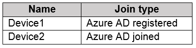  

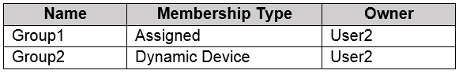  

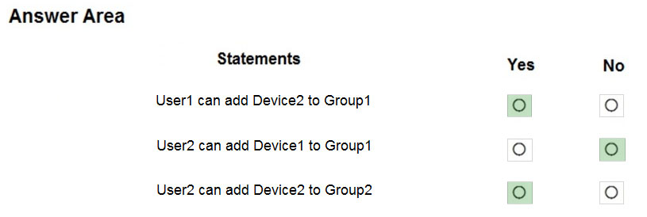 

38# Tiene una suscripción de Azure que contiene un grupo de recursos denominado RG26.
RG26 se establece en la ubicación de Europa Occidental y se utiliza para crear recursos temporales para un proyecto. RG26 contiene los recursos que se muestran en la tabla siguiente.   

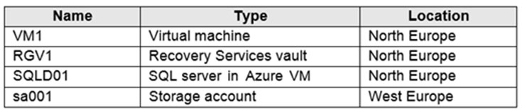

39# Se realiza una copia de seguridad de SQLDB01 en RGV1.
Cuando se completa el proyecto, intenta eliminar RG26 desde Azure Portal. Se produce un error en la eliminación.
Debe eliminar RG26.

¿Qué debes hacer primero?

A. Eliminar VM1

B. Detener VM1

>C. Detener la copia de seguridad de SQLDB01 Más votados

D. Eliminar sa001

40# Tiene una suscripción de Azure denominada Subscription1 que contiene una red virtual denominada VNet1. VNet1 está en un grupo de recursos denominado RG1.
Subscription1 tiene un usuario denominado User1. User1 tiene los siguientes roles:

✑ Seguridad del lector Lector
de seguridad del administrador
✑ Debe asegurarse de que el usuario1 pueda asignar el rol de lector
✑ para VNet1 a otros usuarios.

¿Qué debe hacer?

A. Quite User1 de los roles Lector de seguridad y Lector para Subscription1.

> B. Asigne a User1 el rol de administrador de acceso de usuario para VNet1. Más votados

C. Asigne a User1 el rol Colaborador de red para VNet1.

D. Asigne a User1 el rol Network Contributor para RG1.

41# tiene un inquilino de Azure Active Directory (Azure AD) denominado contosocloud.onmicrosoft.com.
Su empresa tiene una zona DNS pública para contoso.com.
Agregar contoso.com como un nombre de dominio personalizado a Azure AD.Debe asegurarse de que Azure puede comprobar el nombre de dominio.

¿Qué tipo de registro DNS debe crear?

>A. MX Más votados

B. NSEC

C. NAD

D. RRSIG

42# Tiene un inquilino de Azure Directory (Azure AD) denominado Adatum y una suscripción de Azure denominada Subscription1. Adatum contiene un grupo denominado Desarrolladores.
Subscription1 contiene un grupo de recursos denominado Dev.Debe proporcionar al grupo Desarrolladores la capacidad de crear aplicaciones lógicas de Azure en el grupo de recursos Dev.

Solución: en Dev, asigne el rol Colaborador al grupo Desarrolladores.
¿Esto cumple con el objetivo?

>A. Sí Más votados

B. No

ARRASTRAR SOLTAR:
43# tiene una suscripción de Azure que usan cuatro departamentos de la empresa. La suscripción contiene 10 grupos de recursos. Cada departamento utiliza recursos en varios grupos de recursos.
Debe enviar un informe al departamento de finanzas. El informe debe detallar los costos para cada departamento.

¿Qué tres acciones debe realizar en secuencia? Para responder, mueva las acciones apropiadas de la lista de acciones al área de respuesta y organícelas en el orden correcto.
Seleccione y coloque:

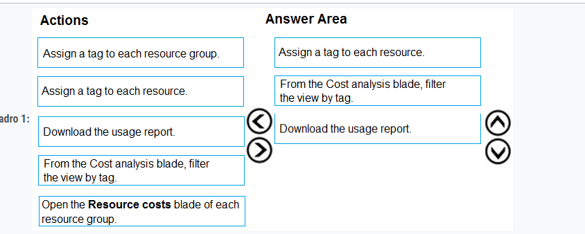

44# Tiene una suscripción de Azure denominada Subscription1 que contiene un área de trabajo de Azure Log Analytics denominada Workspace1.
Debe ver los eventos de error de una tabla denominada Event.
¿Qué consulta debe ejecutar en Workspace1?

A. Evento Get-Event | donde {$_. EventType == "error"}

>B. buscar en (Evento) "error" Más votados

C. select * from Event where EventType == "error"

D. buscar en (Evento) * | donde EventType -eq "error"

HOTSPOT:
45# tiene una suscripción de Azure que contiene una red virtual denominada VNET1 en la región Este de EE. UU. 2. Una interfaz de red denominada VM1-NI está conectada a
VNET1.
Implemente correctamente la siguiente plantilla de Azure Resource Manager.

46# Tiene una suscripción de Azure denominada Subscription1. Subscription1 contiene los grupos de recursos de la tabla siguiente.

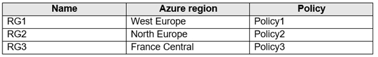  

47# Tiene una suscripción de Azure denominada Subscription1. Subscription1 contiene los grupos de recursos de la tabla siguiente.

RG1 tiene una aplicación web llamada WebApp1. WebApp1 se encuentra en Europa Occidental.
Mover WebApp1 a RG2.

¿Cuál es el efecto de la mudanza?

>A. El plan del Servicio de aplicaciones para WebApp1 permanece en Europa occidental. La directiva2 se aplica a WebApp1.

B. El plan del Servicio de aplicaciones para WebApp1 se traslada al norte de Europa. La directiva2 se aplica a WebApp1.

C. El plan del Servicio de aplicaciones para WebApp1 permanece en Europa occidental. La directiva1 se aplica a WebApp1.

D. El plan del Servicio de aplicaciones para WebApp1 se traslada al norte de Europa. La directiva1 se aplica a WebApp1.
 

48# Tiene una suscripción de Azure.
Los usuarios acceden a los recursos de la suscripción desde casa o desde los sitios de los clientes. Desde casa, los usuarios deben establecer una VPN de punto a sitio para acceder a los recursos de Azure. Los usuarios de los sitios del cliente acceden a los recursos de Azure mediante VPN de sitio a sitio.Tiene una aplicación de línea de negocio denominada App1 que se ejecuta en varias máquinas virtuales de Azure.
Las máquinas virtuales ejecutan Windows Server 2016.
Debe asegurarse de que las conexiones a App1 estén distribuidas en todas las máquinas virtuales.

¿Cuáles son los dos posibles servicios de Azure que puede usar? Cada respuesta correcta presenta una solución completa.
NOTA: Cada selección correcta vale un punto.

>A. Un equilibrador de carga interno

B. Un equilibrador de carga público

C. una red de entrega de contenido (CDN) de Azure

D. Administrador de tráfico

>E. una puerta de enlace de aplicaciones de Azure

49# Tiene una suscripción de Azure.
Tiene 100 máquinas virtuales de Azure.
Debe identificar rápidamente las máquinas virtuales infrautilizadas cuyo nivel de servicio se puede cambiar a una oferta menos costosa.
¿Qué cuchilla debes usar?

A. Monitor

>B. Advisor Most Voted

C. Metrics

D. Customer insights

50# HOTSPOT:
tiene un inquilino de Azure Active Directory (Azure AD).
Debe crear una directiva de acceso condicional que requiera que todos los usuarios usen la autenticación multifactor cuando accedan a Azure Portal.

¿Qué tres ajustes debe configurar? Para responder, seleccione la configuración adecuada en el área de respuesta.
NOTA: Cada selección correcta vale un punto.
Zona caliente:

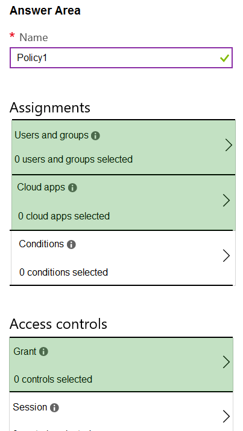

#51 Tiene un inquilino de Azure Active Directory (Azure AD) denominado contoso.onmicrosoft.com.
El rol Administrador de usuarios se asigna a un usuario denominado Admin1.
Un socio externo tiene una cuenta Microsoft que usa el inicio de sesión user1@outlook.com.
Admin1 intenta invitar al asociado externo a iniciar sesión en el inquilino de Azure AD y recibe el siguiente mensaje de error: 'No se puede invitar al usuario user1@outlook.com '" Excepción de autorización genérica.'
Debe asegurarse de que Admin1 pueda invitar al socio externo a iniciar sesión en el inquilino de Azure AD.
¿Qué debe hacer?

>A. En la hoja Configuración de usuarios, modifique la configuración de colaboración externa. Más votados

B. En la hoja Nombres de dominio personalizados, agregue un dominio personalizado.

C. En la hoja Relaciones organizativas, agregue un proveedor de identidades.

D. En la hoja Roles y administradores, asigne el rol Administrador de seguridad a Admin1.